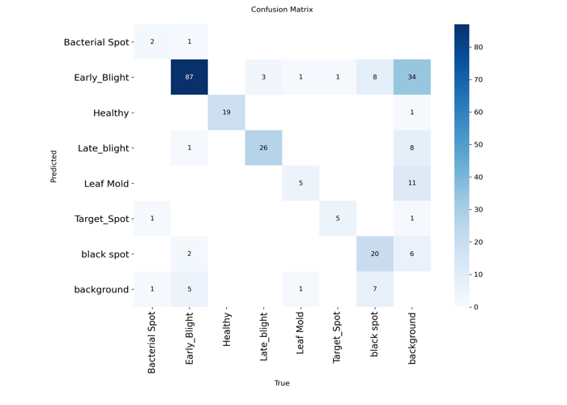
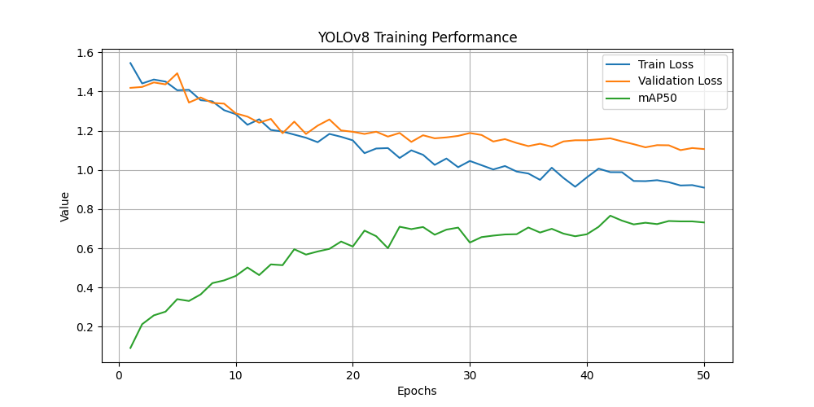

# 🍅 Tomato Disease Detection Using YOLOv8

YOLOv8-based tomato leaf disease detection system using deep learning and object detection.

## Features

- YOLOv8 object detection
- ONNX export support
- Confusion matrix
- Training graphs
- Sample predictions

## Model Performance

- mAP50: 0.76
- mAP50-95: 0.47

## Sample Predictions

## Confusion Matrix

## Training Graph

